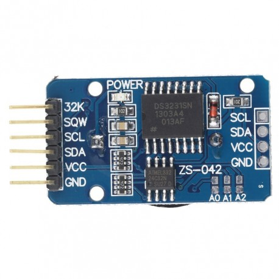

# Jam_P10
Membut jam digital P10

Berikut koneksi pin P10 ke Arduino Uno, saya mencobanya ke Arduino Mega bisa juga:
   
Pinout Arduino Mega:  
   
RTC yang saya gunakan DS3231SN yang support pembacaan temperatur dan lebih presisi dibanding versi sebelumnya :  
   

Berikut Hasil pembuatan Jam P10 yang saya buat:  
   
